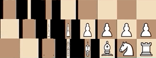

# Chesses 3

## [Play Online](https://www.pippinbarr.com/chesses3)

---

## Description

*How much chess would a chess guy chess if a chess guy would chess chess?! Eight more chess variations hot and chessy out of the chess oven! Chess 'em up!*

*Chesses 3* is the next in my *Chesses* series, following [*Chesses*](https://pippinbarr.github.io/chesses/) and [*Chesses 2*](https://pippinbarr.github.io/chesses2/). It's eight more variations on the standard game of chess, including a test of your psionic powers, a humbling learning opportunity with Gary Kasparov, and the prestigious art of dressage.

## Documentation

* Read the [Press kit](https://github.com/pippinbarr/chesses3/blob/master/press/README.md) for press information
* Read the [Process documentation](https://github.com/pippinbarr/chesses3/blob/master/process/README.md) for process journal, to do list, and related work
* Read the [Commit History](https://github.com/pippinbarr/chesses3/commits/master) for step-by-step information about how the project was built
* Look at the [Code Repository](https://github.com/pippinbarr/chesses3) for source code etc.

## License

*Chesses 3* is an open source game licensed under a [Creative Commons Attribution-NonCommercial 3.0 Unported License](http://creativecommons.org/licenses/by-nc/3.0/). You can obtain the source code from its [code repository](https://github.com/pippinbarr/chesses3) on GitHub.
