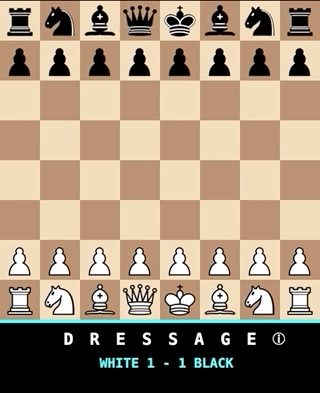
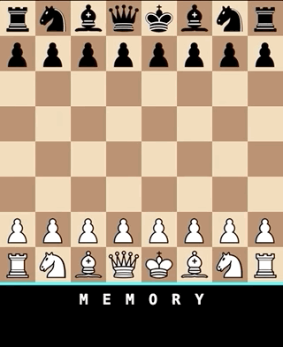

# _Chesses 3_ Press Kit

_How much chess would a chess guy chess if a chess guy would chess chess?! Eight more chess variations hot and chessy out of the chess oven! Chess 'em up!_

#### [Play _Chesses 3_](https://pippinbarr.github.io/chesses3) (Desktop and Mobile)

## The basics

* Developer: [Pippin Barr](http://www.pippinbarr.com/)
* Release: 30 April 2020
* Platform: Browser (desktop and mobile)
* Code repository: https://github.com/pippinbarr/chesses3
* Price: $0.00

## Who is this Pippin Barr guy?

Pippin is an experimental game developer who has made games about everything from [Eurovision](http://www.pippinbarr.com/2012/03/27/epic-sax-game/) to [performance art](http://www.pippinbarr.com/2011/09/14/the-artist-is-present/) to [dystopian post-work futures](http://www.pippinbarr.com/games/2017/07/03/it-is-as-if-you-were-doing-work.html). He's an Assistant Professor in the [Department of Design and Computation Arts](http://www.concordia.ca/finearts/design.html) at [Concordia University](http://www.concordia.ca/) in Montréal. He is also the associate director of the [Technoculture, Art, and Games (TAG)](http://tag.hexagram.ca/) Research Centre, which is part of the [Milieux Institute for Arts, Culture, and Technology](http://milieux.concordia.ca/).

## Description

_Chesses 3_ is the next in my _Chesses_ series, following [_Chesses_](https://pippinbarr.github.io/chesses/) and [_Chesses 2_](https://pippinbarr.github.io/chesses2/). It's eight more variations on the standard game of chess, including a test of your psionic powers, a humbling learning opportunity with Gary Kasparov, and the prestigious art of dressage.

## History

I started _Chesses 3_ because it's still a COVID-19 world and I've found it therapeutic to work on fairly "straightforward" game projects that can be designed and implemented smoothly and usually without extremely difficult exercises in design or code. Having already made two sets of eight variations, I've become curious to see how far along I can push this, and was worried for a while that the variations I was putting into this version were somehow less legitimate or "gamelike" than the previous iterations. In the end, though, I'm quite satisfied with what's in this set. It's a decent blend of joke-y things, fairly playable games, and even an educational experience.

_Chesses 3_ is also another data-point in the ultra-detailed process documentation approach called [MDMA](http://www.gamesasresearch.com/mdma). So, if you want to, you can read a lot about the game's development by reading its [process documentation](https://github.com/pippinbarr/chesses3/blob/master/process/README.md) and by going through its [commit history](https://github.com/pippinbarr/chesses3/commits/master).

## Technology

_Chesses 3_ was created in JavaScript using the ever-so-useful [chess.js](https://github.com/jhlywa/chess.js) and [chessboard.js](https://chessboardjs.com/) libraries which together make representing chess (or variants) remarkably straightforward compared to the true nightmare it would be to do from scratch. It also involves some [jQuery](https://jquery.com/) and [jQuery UI](https://jqueryui.com/). The tones in Dressage are care of the lovely sound library [Pizzicato.js](https://alemangui.github.io/pizzicato/) and the sound effects are via [howler.js](https://howlerjs.com/).

## License

_Chesses 3_ is an open source game licensed under a [Creative Commons Attribution-NonCommercial 3.0 Unported License](http://creativecommons.org/licenses/by-nc/3.0/). You can obtain the source code from its [code repository](https://github.com/pippinbarr/chesses) on GitHub.

## Features

- The end of hostilities!
- Laughter!
- Prancing ponies!
- Mind tricks!
- Patrick Swayze!?

### Trailer

See animated GIFs.

## Images

  
3'44"

  
DRESSAGE

  
IMMORTAL

  
MEMORY

  
PACIFIST

## Press

Coming soon?

## Additional Links

- [Process documentation of _Chesses 3_](https://github.com/pippinbarr/chesses3/blob/master/process/README.md)
- [Commit history of _Chesses 3_](https://github.com/pippinbarr/chesses3/commits/master)

## Credits

* Pippin Barr: design and implementation
* Hand icon in GHOST by Unbekannter Grafiker, keine Schöpfungshöhe - Screenshot, keine Schöpfungshöhe, Public Domain, https://commons.wikimedia.org/w/index.php?curid=7799880
* Laughter in COMEDY from [sandyrb](https://freesound.org/people/sandyrb) on [freesound.org](https://freesound.org)

## Contact

* Email: [pippin.barr+press@gmail.com](mailto:pippin.barr+press@gmail.com)
* Website: [www.pippinbarr.com](http://www.pippinbarr.com/)
* Twitter: [@pippinbarr](https://www.twitter.com/pippinbarr)
* Instagram: [@pippinbarr](https://www.instagram.com/pippinbarr)
* Facebook: [Pippin Barr](http://www.facebook.com/pippin.barr)
